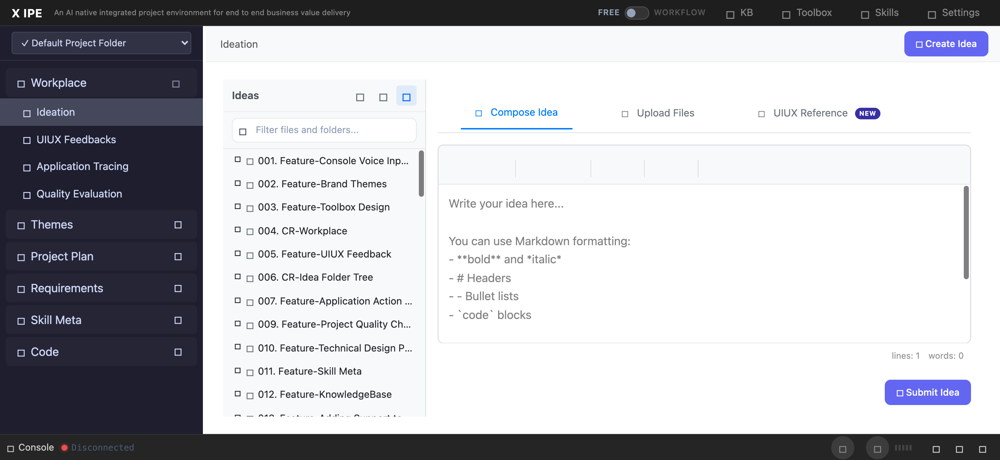

# UI/UX Feedback

**ID:** Feedback-20260313-165013
**URL:** http://127.0.0.1:5858/
**Date:** 2026-03-13 21:07:01

## Selected Elements

- `{'selector': '#workplace-submit-idea', 'parents': ['div#ideaTabContent', 'div#compose-pane', 'div.workplace-compose', 'div.workplace-compose-actions']}`

## Feedback

on the same line of submit button, add a KB reference button on most left side. when clicks on it, show KB REFERENCE PICKER. 2. when it's click's insert it should insert the selected knowledges. 3. the logic used to insert knowledge: a. when click open the reference picker modal, it should record which idea-folder it's calling it. so when it's insert, it can insert a .knowledge-reference.yaml. and linking the knowledge file path within it. the format should be:
knowledge-reference:
- xxxx
- xxxx
4. after insert the knowledge reference, we should show a reference knowledge count label, when we click on it, should a inline popup to show the referenced knowledge with it's type icon(folder or file)

## Screenshot

