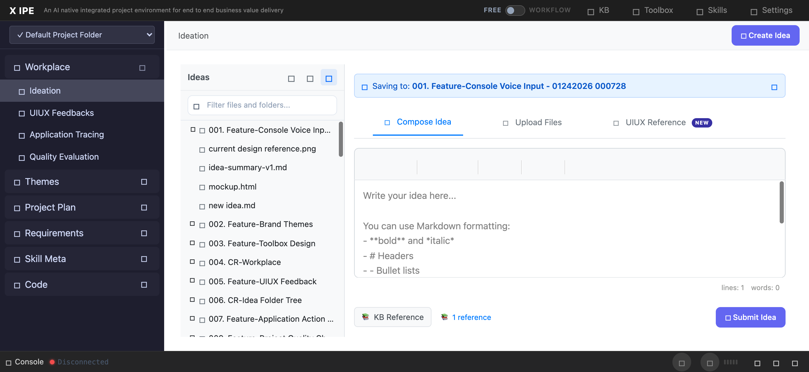

# UI/UX Feedback

**ID:** Feedback-20260313-215355
**URL:** http://127.0.0.1:5858/
**Date:** 2026-03-13 21:57:42

## Selected Elements

- `{'selector': '#workplace-kb-ref-btn', 'parents': ['div#ideaTabContent', 'div#compose-pane', 'div.workplace-compose', 'div.workplace-compose-actions']}`

## Feedback

for the KB Reference button and the reference indicator label, let's move the tab bar area and on the most right side.(the KB Reference button on the most right side, the reference label on it's left side). 2. when we click the insert, not only show the reference label but also create the .knowledge-reference.yaml under the folder of it(if not exists create it). 3. when I hover on reference label we should show a delete icon, so we can remove the reference .yaml

## Screenshot

