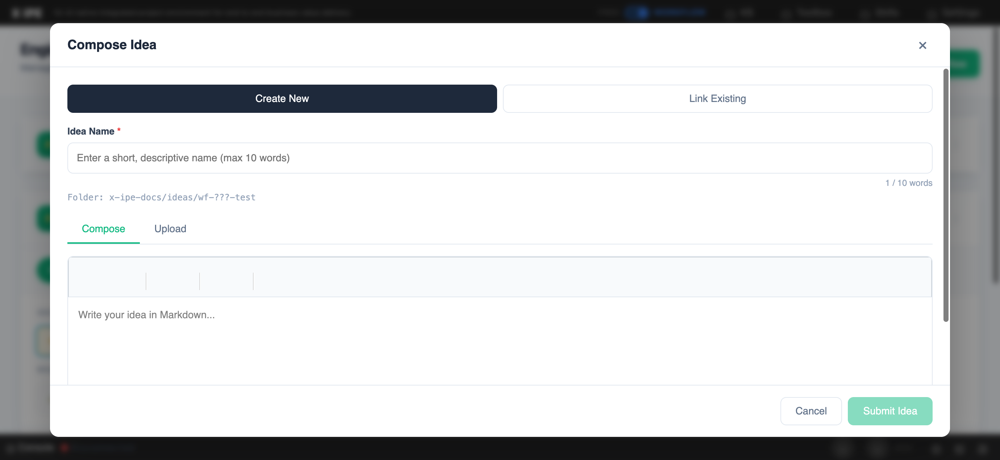

# UI/UX Feedback

**ID:** Feedback-20260314-145004
**URL:** http://127.0.0.1:5858/
**Date:** 2026-03-14 14:50:53

## Selected Elements

- `{'selector': 'div.compose-modal-tabs', 'parents': ['div.compose-modal-overlay.active', 'div.compose-modal', 'div.compose-modal-body', 'div.compose-modal-create-content']}`

## Feedback

when we click on compose idea action, we should have the same reference KB icon and reference count label

## Screenshot

