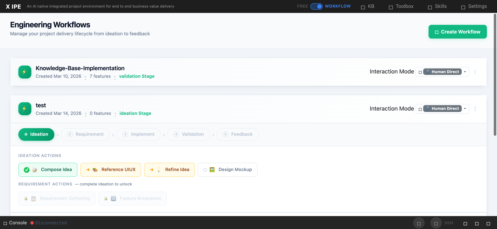

# UI/UX Feedback

**ID:** Feedback-20260314-152441
**URL:** http://127.0.0.1:5858/
**Date:** 2026-03-14 15:28:13

## Selected Elements

- `{'selector': 'div.deliverable-card:nth-of-type(1)', 'parents': ['div.deliverables-area', 'div.deliverables-grid', 'div.deliverables-feature-section', 'div.deliverables-row']}`

## Feedback

can we have update the deliverable tag and context input, for example. "$output:raw-idea" in the workflow template.json, let change it to "$output:raw-ideas", so it can receiving multiple outputs, in this example I have the new-idea.md, we also should listing two png I uploaded from composing idea

## Screenshot

