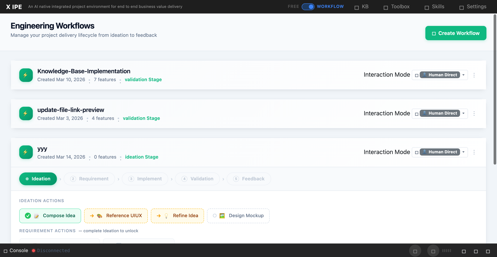

# UI/UX Feedback

**ID:** Feedback-20260314-174241
**URL:** http://127.0.0.1:5858
**Date:** 2026-03-14 17:44:27

## Selected Elements

- `{'selector': 'div.deliverable-card:nth-of-type(3)', 'parents': ['div.deliverables-area', 'div.deliverables-grid', 'div.deliverables-feature-section', 'div.deliverables-row']}`

## Feedback

for the folders in the deliverables, let's having the beside the subtitle, and make them as small as sub title, so we can more clearly know which is folders from deliverable, which is generated files

## Screenshot

