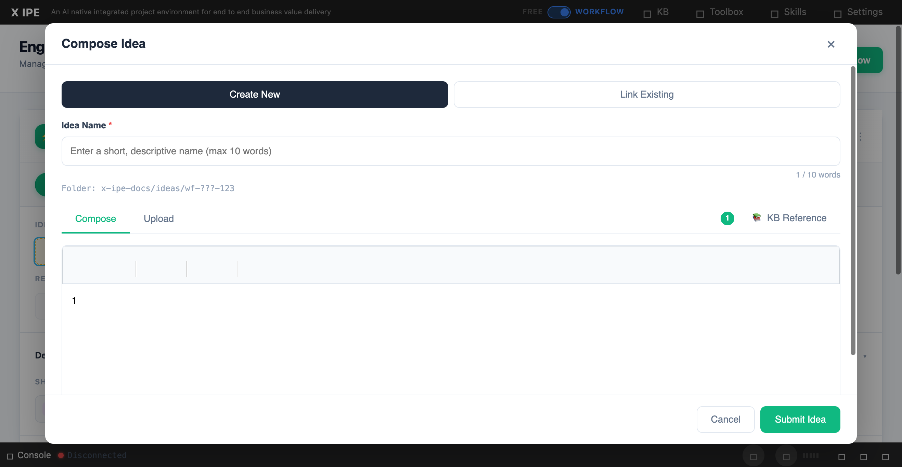

# UI/UX Feedback

**ID:** Feedback-20260314-234833
**URL:** http://127.0.0.1:5858
**Date:** 2026-03-15 00:03:42

## Selected Elements

## Feedback

when reopen the composed idea, and I referenced a knowledge with some composing idea content, but looks like nothing is changed, expectation, 1. the deliverable file should show the composed idea and refrenced knowledge.

## Screenshot

