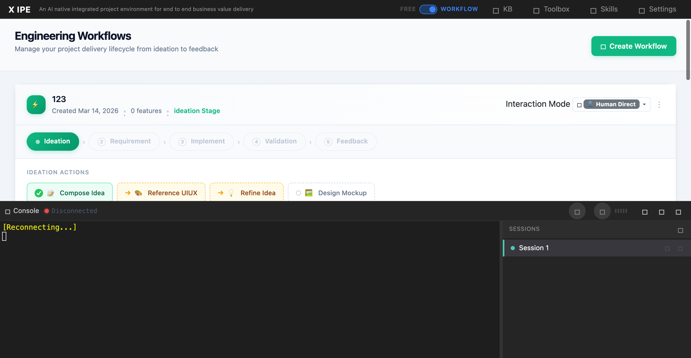

# UI/UX Feedback

**ID:** Feedback-20260316-100612
**URL:** http://127.0.0.1:5858/
**Date:** 2026-03-16 10:07:56

## Selected Elements

- `{'selector': '#session-explorer', 'parents': ['div#page-root', 'div#terminal-panel', 'div#terminal-body']}`

## Feedback

for the session area, let's no only suport bigger or smaller, let's also have a small toggle on the border, if we click on the border it should expend or collapse it

## Screenshot

