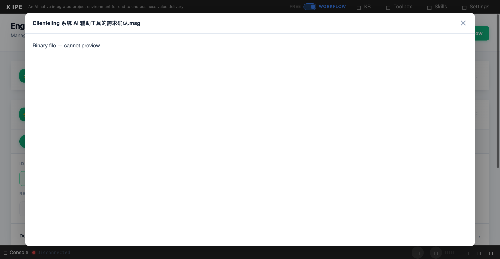

# UI/UX Feedback

**ID:** Feedback-20260316-113736
**URL:** http://127.0.0.1:5858/
**Date:** 2026-03-16 11:40:52

## Selected Elements

- `{'selector': 'div.preview-content', 'parents': ['div.deliverable-preview-backdrop.active', 'div.deliverable-preview']}`

## Feedback

for workflow 'test' I have uploaded two files, one it's docx, one is msg. when I preview them in file preview or open in the folder view, we all need to see it's content, you can research see if it's achivable, if so, implement it

## Screenshot

