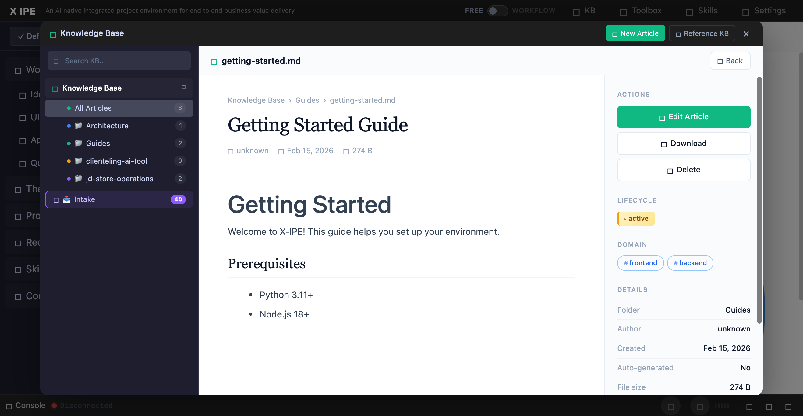

# UI/UX Feedback

**ID:** Feedback-20260317-160429
**URL:** http://127.0.0.1:5858/
**Date:** 2026-03-17 16:07:26

## Selected Elements

- `{'selector': 'div.kb-article-sidebar', 'parents': ['div.kb-modal-body', 'div.kb-modal-content', 'div.kb-scene.active', 'div.kb-article-layout']}`

## Feedback

1. the knowledge inspection section should show the description of the knowledge file as well.

## Screenshot

