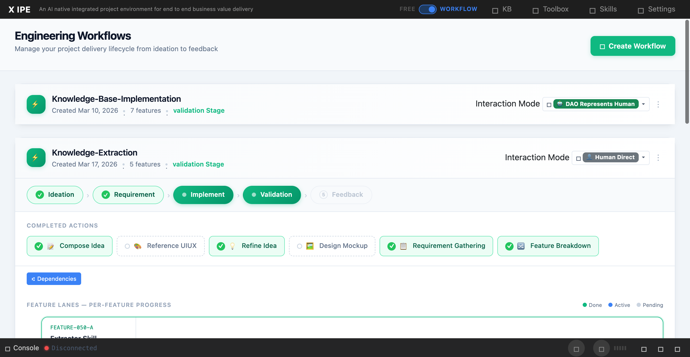

# UI/UX Feedback

**ID:** Feedback-20260317-161023
**URL:** http://127.0.0.1:5858/
**Date:** 2026-03-17 16:12:49

## Selected Elements

- `{'selector': 'span.deliverable-folder-chip:nth-of-type(1)', 'parents': ['div.deliverables-area', 'div.deliverables-grid', 'div.deliverables-feature-section', 'div.deliverables-section-title-row']}`

## Feedback

1. for the deliverables, looks like we have duplicated display for example 'feature-docs-folder' appeared 3 times for feature-050-B. let's fix the duplication.
2. for it's deliverable sub header, why not we have an line below it expend to the whole panel, and move all the folders align most right.

## Screenshot

