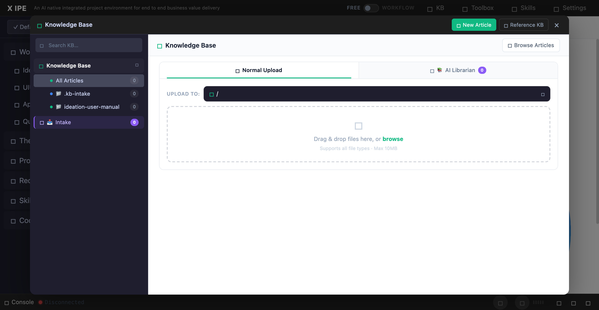

# UI/UX Feedback

**ID:** Feedback-20260318-083710
**URL:** http://127.0.0.1:5858/
**Date:** 2026-03-18 08:41:59

## Selected Elements

- `{'selector': 'button.kb-upload-mode-btn:nth-of-type(2)', 'parents': ['div.kb-scene.active', 'div', 'div.kb-upload-section', 'div.kb-upload-mode-bar']}`

## Feedback

for intake in upload view or in intake view, you would see the file count is 0, but accually I uploaded a folder, and within the folder there are many files. so 1. the count logic should be. only show top level folder or files within the .intake folder in knowledge-base folder. 2. in ui we need to support the display not only for file but also for folders, and folder should be able to expend to see it's file for sub folders, sub folder should follow the same logic. (since the intake view is file list view, you should think of UIUX to adapt this change.)

## Screenshot

