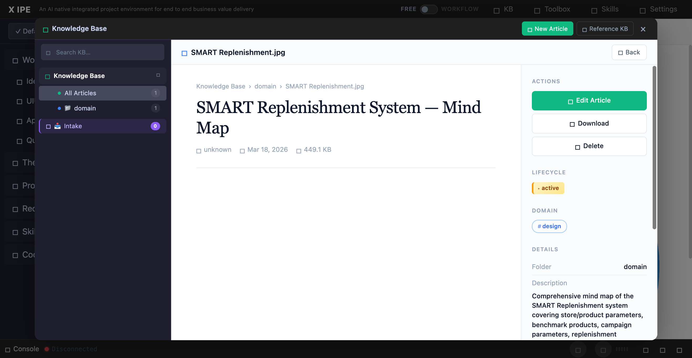

# UI/UX Feedback

**ID:** Feedback-20260318-095642
**URL:** http://127.0.0.1:7171/
**Date:** 2026-03-18 09:57:11

## Selected Elements

- `{'selector': 'div.kb-article-main', 'parents': ['div.kb-modal-body', 'div.kb-modal-content', 'div.kb-scene.active', 'div.kb-article-layout']}`

## Feedback

the knowledge preview should be able to see .jpg and other image files display

## Screenshot

