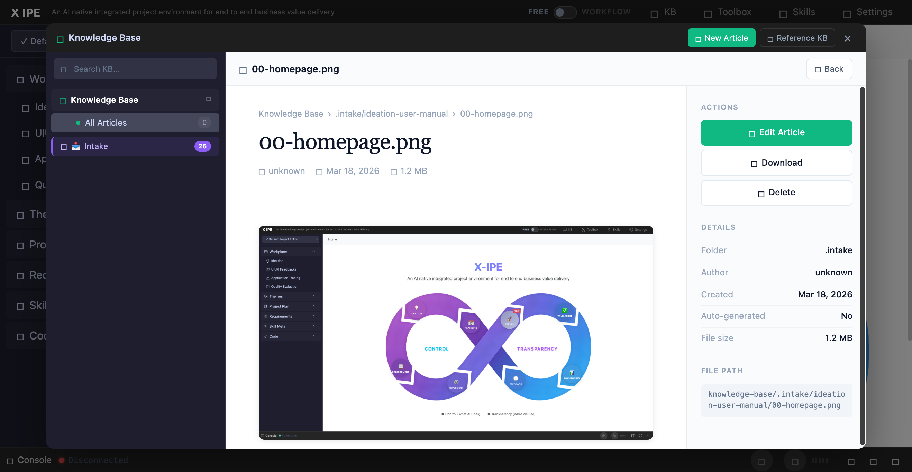

# UI/UX Feedback

**ID:** Feedback-20260318-102218
**URL:** http://127.0.0.1:5858/
**Date:** 2026-03-18 10:23:51

## Selected Elements

- `{'selector': 'div.kb-article-header-block', 'parents': ['div.kb-modal-content', 'div.kb-scene.active', 'div.kb-article-layout', 'div.kb-article-main']}`

## Feedback

the document and image rendering area should span to the entire area, you can have margin to left and right, but fully utilize the white space

## Screenshot

