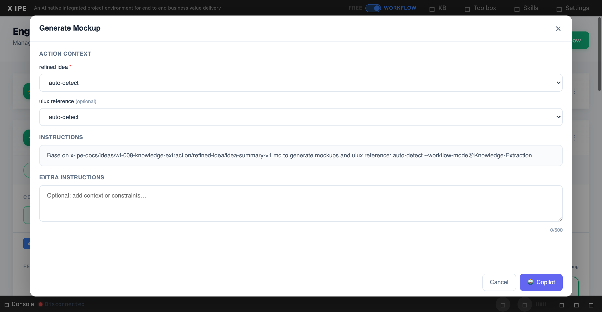

# UI/UX Feedback

**ID:** Feedback-20260318-173426
**URL:** http://127.0.0.1:5858/
**Date:** 2026-03-18 17:39:23

## Selected Elements

- `{'selector': 'div.instructions-content', 'parents': ['div.modal-overlay', 'div.modal-container', 'div.modal-body', 'div.instructions-section']}`

## Feedback

there are 3 feedbacks: 1. when we run in lang = zh, in workflow mode we should see the instructions in Chinese version, just like the prompt we see in free mode if we select zh it will type chinese. 2. the claude code command should not with -p, for example claude -p "Your prompt here" is wrong, we need just claude "Your prompt here". 3. for the x-ipe upgrade, it should also support switch language, just like init

## Screenshot

