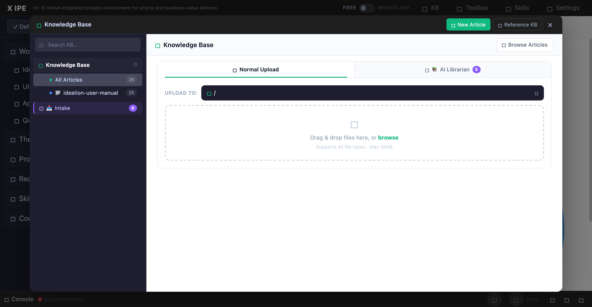

# UI/UX Feedback

**ID:** Feedback-20260318-205614
**URL:** http://127.0.0.1:5858/
**Date:** 2026-03-18 20:57:28

## Selected Elements

- `{'selector': 'div.kb-upload-zone', 'parents': ['div', 'div.kb-upload-section', 'div.kb-upload-mode-content', 'div.kb-upload-panel.active']}`

## Feedback

the normal uploading should have an indication the uploading is succeed, and now only support drag and drop, can we also support click open a native file selection window to select.

## Screenshot

