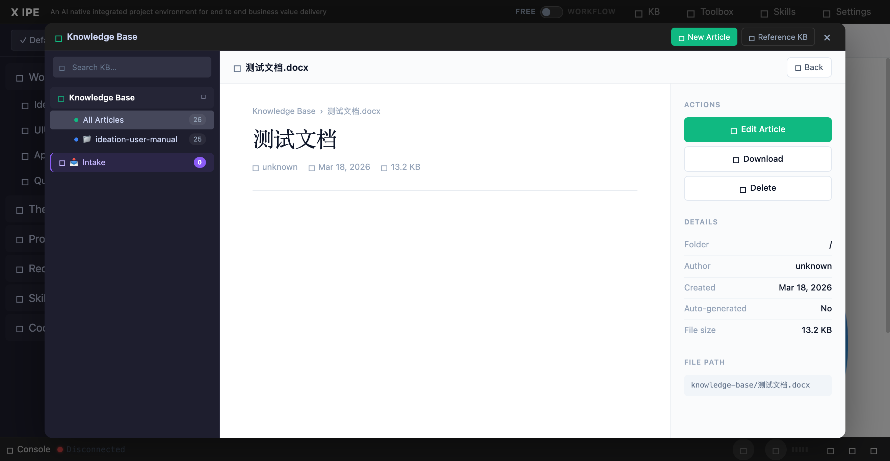

# UI/UX Feedback

**ID:** Feedback-20260318-213942
**URL:** http://127.0.0.1:5858/
**Date:** 2026-03-18 21:43:26

## Selected Elements

- `{'selector': 'div.kb-article-main', 'parents': ['div.kb-modal-body', 'div.kb-modal-content', 'div.kb-scene.active', 'div.kb-article-layout']}`

## Feedback

the preview of the file should be like the deliverable preview in workflow mode. it should support docx. please also review the preview there make sure all the supported file there should be also supported here. and why not from technical perspective, can we share the same preview logic or component so we won't have this kind of inconsistancy. please check the other places, I rememeber we do have several other places have file preview function. if we can make all of them consistent

## Screenshot

