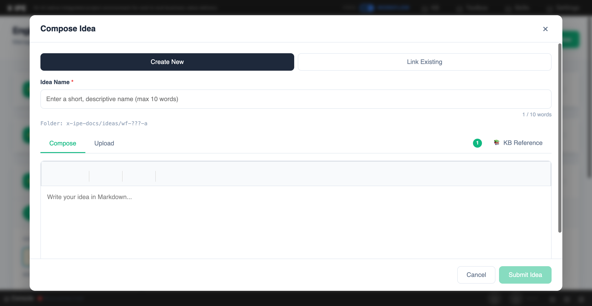

# UI/UX Feedback

**ID:** Feedback-20260319-130251
**URL:** http://127.0.0.1:5858/
**Date:** 2026-03-19 13:04:04

## Selected Elements

- `{'selector': 'div.compose-modal-kb-ref-item', 'parents': []}`

## Feedback

when we try to link the do to the compose idea, it;s no longer works. it should support docs in either zh and en

## Screenshot

