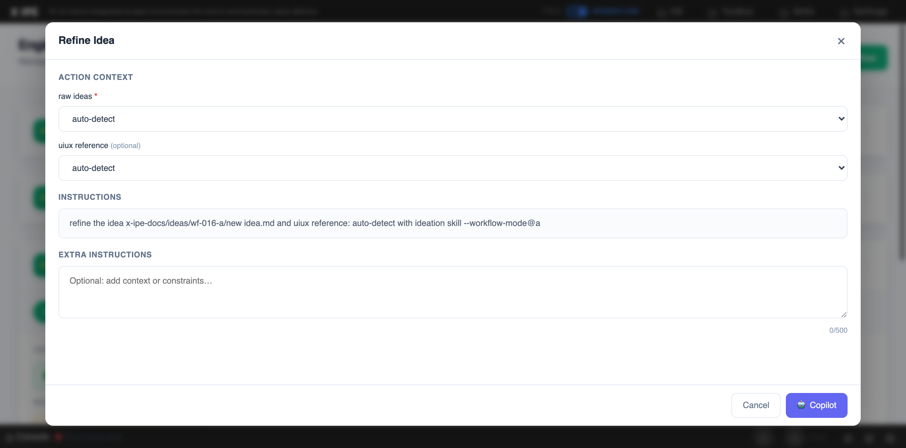

# UI/UX Feedback

**ID:** Feedback-20260322-215956
**URL:** http://127.0.0.1:5858/
**Date:** 2026-03-22 22:00:53

## Selected Elements

- `{'selector': 'div.instructions-content', 'parents': ['div.modal-overlay', 'div.modal-container', 'div.modal-body', 'div.instructions-section']}`

## Feedback

when the language in .x-ipe.yaml set to zh, the instruction should be in chinese, expect [--isntructions] for example --workflow-mode...

## Screenshot

