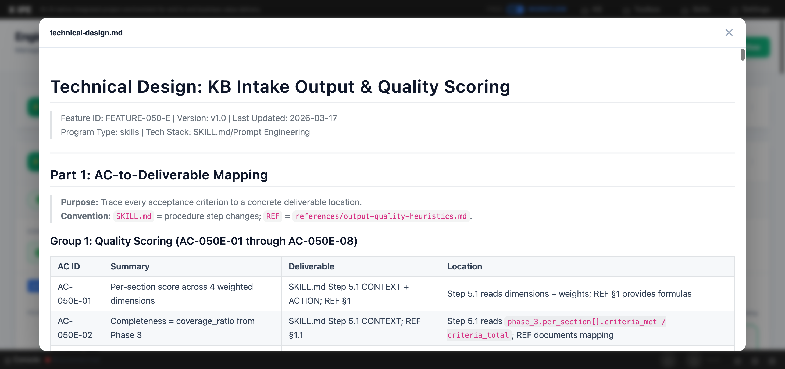

# UI/UX Feedback

**ID:** Feedback-20260326-212334
**URL:** http://127.0.0.1:5858/
**Date:** 2026-03-26 21:27:41

## Selected Elements

- `{'selector': 'div.preview-header', 'parents': ['div.deliverable-preview-backdrop.active', 'div.deliverable-preview']}`

## Feedback

for the modal window in the workflow mode, why not let's adding several icons. one for downloading the file, one for show in preview mode or raw file mode. by default all the file in preview mode, but if a file under */src/* should be in raw mode.

## Screenshot

