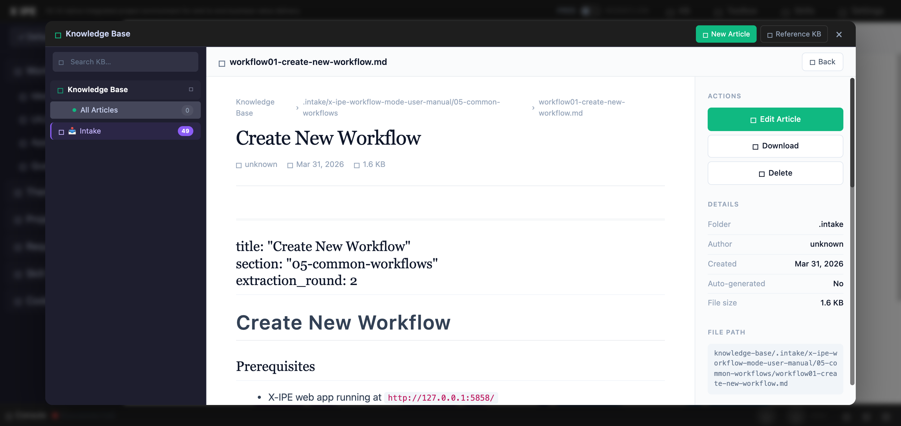

# UI/UX Feedback

**ID:** Feedback-20260331-165935
**URL:** http://127.0.0.1:5858/
**Date:** 2026-03-31 17:01:00

## Selected Elements

- `{'selector': 'img:nth-child(1)', 'parents': ['div#content-body', 'div.homepage-infinity-container', 'div.infinity-loop-container', 'div.infinity-loop']}`

## Feedback

the syntax and the value is correct and the image file do exists, 

so pleaes update the knowledge base preview function to support the image display

## Screenshot

