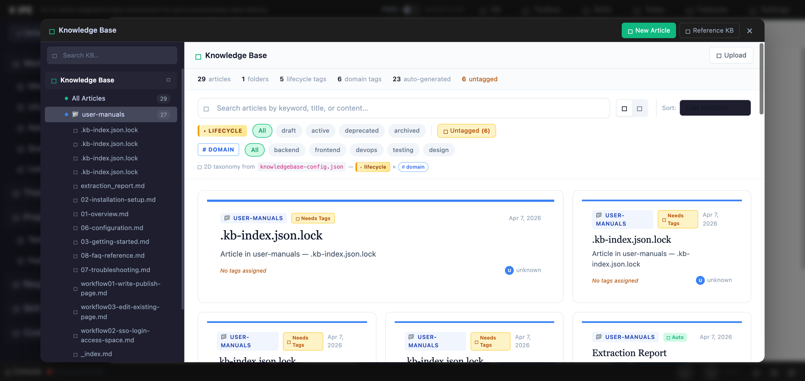

# UI/UX Feedback

**ID:** Feedback-20260407-132358
**URL:** http://127.0.0.1:6161/
**Date:** 2026-04-07 13:28:32

## Selected Elements

- `{'selector': 'div.kb-sidebar-folder:nth-of-type(2)', 'parents': ['div.kb-modal-sidebar', 'div.kb-modal-sidebar-content', 'div.kb-sidebar-section', 'div.kb-sidebar-section-content.open']}`

## Feedback

let me report several bugs related to knowledge base:
the phyical folder path is in /Users/yzhang/Documents/projects/work-with-confluence/x-ipe-docs/knowledge-base/user-manuals/confluence-write-docs
1. the knowledge base tree view on the left is not scrollable, expect to be scrollable so I can see all the content, 2. under user-manuals there are sub folders, but the tree view didn't list any sub folder, expect the folder and file structure should be the same as phyical folder, 3. we don't need to show the hidden file such as .kb-index.json.lock neither in the tree view or knowledgebase preview. 4. maybe we need update librarian skill, after processing, we should not have .kb-index.json.lock right, it should release the lock.

## Screenshot

