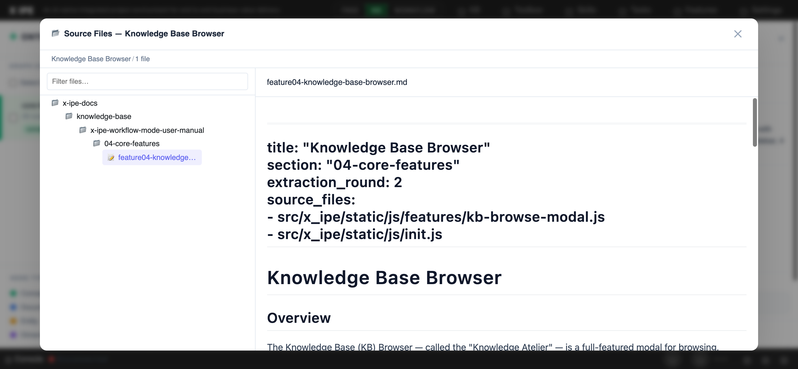

# UI/UX Feedback

**ID:** Feedback-20260410-153039
**URL:** http://127.0.0.1:5001
**Date:** 2026-04-10 15:31:47

## Selected Elements

- `{'selector': 'li.tree-item', 'parents': ['div.folder-browser-body', 'div.folder-browser-tree', 'div.folder-browser-tree-content', 'ul.file-tree']}`
- `{'selector': 'img:nth-child(1)', 'parents': ['div#content-body', 'div.ontology-graph-viewer', 'div.ogv-canvas-area', 'div.ogv-navigator']}`

## Feedback

report two issues, 1. the indent of the sub folder and files don't need be that wider, 2. the image does exists, but looks like the preview doesn't able to find it

## Screenshot

